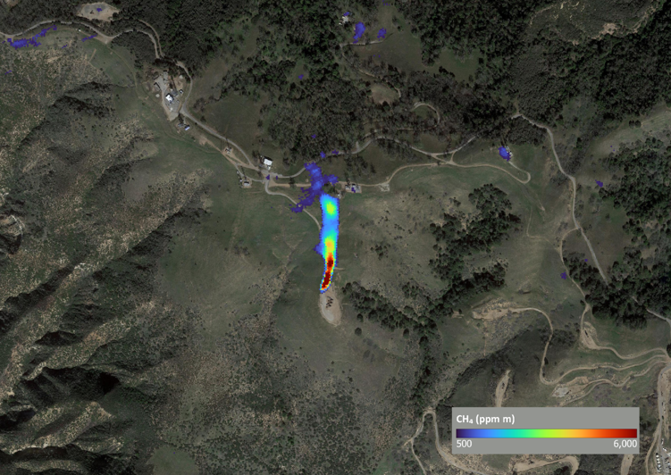
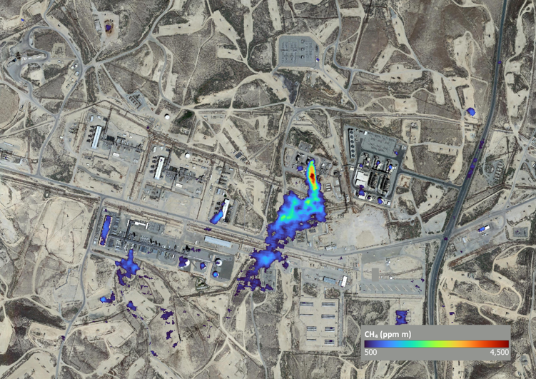
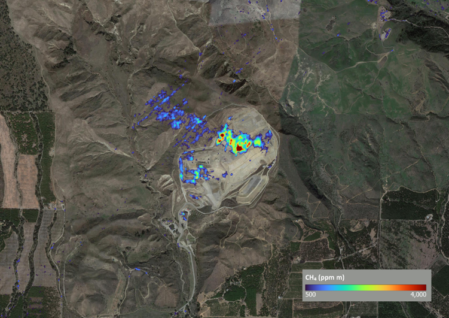

# Methane Plume Detection in AVIRIS-NG Hyperspectral Imagery

## Overview

This repository provides a generalised implementation of the robust matched filter algorithm developed by NASA to detect CH4 / CO2 emissions in [AVIRIS-NG](https://avirisng.jpl.nasa.gov/index.html) hyperspectral imagery as part of its Methane Source Finder programme. Adapted from the [Methane Source Finder](https://github.com/dsmbgu8/srcfinder) open repository, this implementation extends the approach for use with PRISMA and AHSI hyperspectral imagery.

## Execution
```
usage: aviris.py [-h] [--rgb_bands red_idx green_idx blue_idx] [--active_channels ACTIVE_CHANNELS]
                 [--sampling_rate SAMPLING_RATE]
                 input_pathname target_pathname out_pathname
```

- input_pathname: path to input, non-orthocorrected AVIRIS-NG radiance or reflectance image (ENVI raster format)
- target_pathname: path to target absorption spectra (see cfg sub-folder)
- out_pathname: path to output file (RGB image bands + CH4 absorption, units ppm x m)

## Results

Outputs generated by source code located in src sub-folder have been successfully validated against methane enhancement results published on the [Methane Source Finder](https://msf.carb.arb.ca.gov/map) website:



AVIRIS-NG hyperspectral image acquired on 18th September, 2017 clearly highlighted significant leakage of methane from an individual oil well located close to the Santa Susana Mountains in Los Angeles County, California.



AVIRIS-NG hyperspectral image acquired on 6th September, 2017 highlighted a significant emission of methane at the Elk Hills gas power plant and refinery – possibly due to a flaring event. 



Analysis of AVIRIS-NG hyperspectral image acquired on 16th October, 2017 highlighted a large methane plume located over the Toland Road Landfill site caused by the decomposition of organic material e.g. food, wood, paper.

## References

- Frankenberg et. al. (2016), [Airborne methane remote measurements reveal heavy-tail flux distribution in Four Corners region](https://doi.org/10.1073/pnas.1605617113)
- Kwon and Nasrabadi (2004), [Hyperspectral Target Detection Using Kernel Spectral Matched Filter](https://ieeexplore.ieee.org/document/1384923)
- Theiler (2012), [The incredible shrinking covariance estimator](https://doi.org/10.1117/12.918718)
